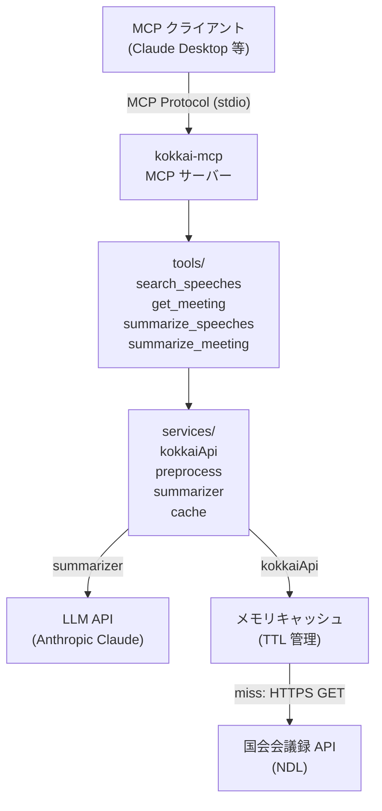

# システム概要

## プロジェクト名

国会議事録検索・要約 MCP サーバー (kokkai-mcp)

## 概要

国会会議録検索システム API（国立国会図書館）を利用し、
発言検索・会議録取得・議事録要約の 3 機能を MCP ツールとして提供するサーバー。
初期版は画面・DB なしの最小構成。Claude Desktop 等の MCP 対応クライアントから利用する。

## コンポーネント図

## 公開 MCP ツール

| ツール名 | 機能 |
|----------|------|
| `search_speeches` | 発言検索（キーワード・発言者・会議名・期間） |
| `get_meeting` | 会議録全体取得（issueID 指定） |
| `summarize_speeches` | 発言群要約（brief / standard / detailed） |
| `summarize_meeting` | 会議録全体要約（issueID 指定） |

## デプロイ形態

- **Transport:** stdio（Claude Desktop との連携に適合）
- **Node.js:** 20+ LTS
- **実行:** `node dist/server.js`
- **設定:** 環境変数（`.env` または Claude Desktop の env 設定）
